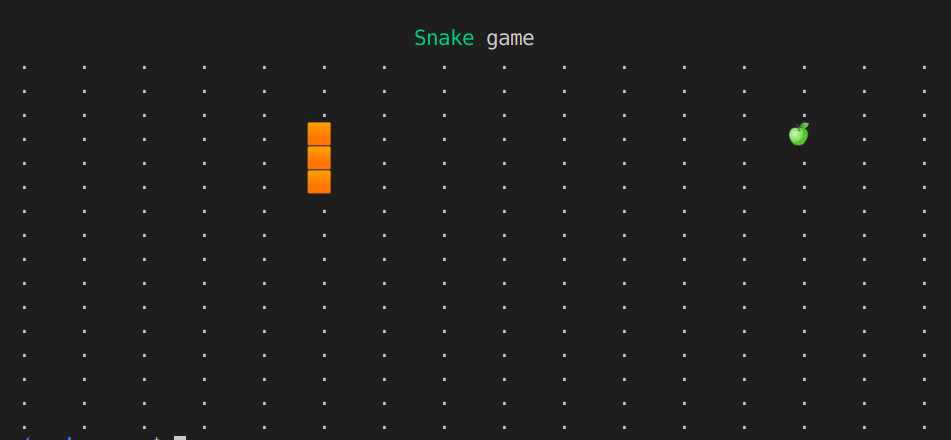

# react cli snake-game

### npm start 

---

> React renderer for command-line apps [ink](https://github.com/vadimdemedes/ink)

> basic project structure for Ink apps [create-ink-app](https://github.com/vadimdemedes/create-ink-app)

> useInterval.js > [Dan Abramov - Making setInterval Declarative with React Hooks](https://overreacted.io/making-setinterval-declarative-with-react-hooks/)

